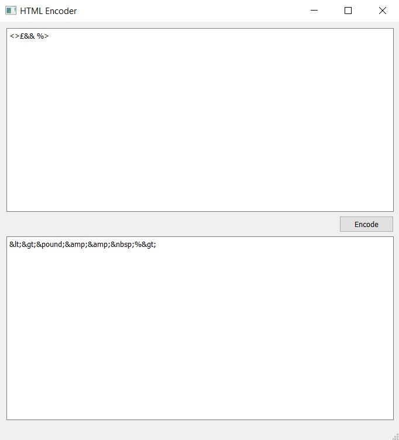

# Html-Encoder

<div align="left">
 
</div>

## About The Project
This is a basic html encoder app that has been developed with Python.

## Tech
* [PyQt5](https://pypi.org/project/PyQt5/) - QT GUI Framework


## License
```xml
Copyright 2022 Mustafa Utku Ensert

Licensed under the Apache License, Version 2.0 (the "License");
you may not use this file except in compliance with the License.
You may obtain a copy of the License at

    http://www.apache.org/licenses/LICENSE-2.0

Unless required by applicable law or agreed to in writing, software
distributed under the License is distributed on an "AS IS" BASIS,
WITHOUT WARRANTIES OR CONDITIONS OF ANY KIND, either express or implied.
See the License for the specific language governing permissions and
limitations under the License.
```


## Contact
[ensertyazilim@gmail.com](#)
